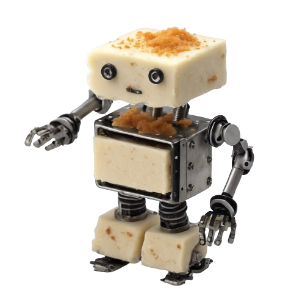
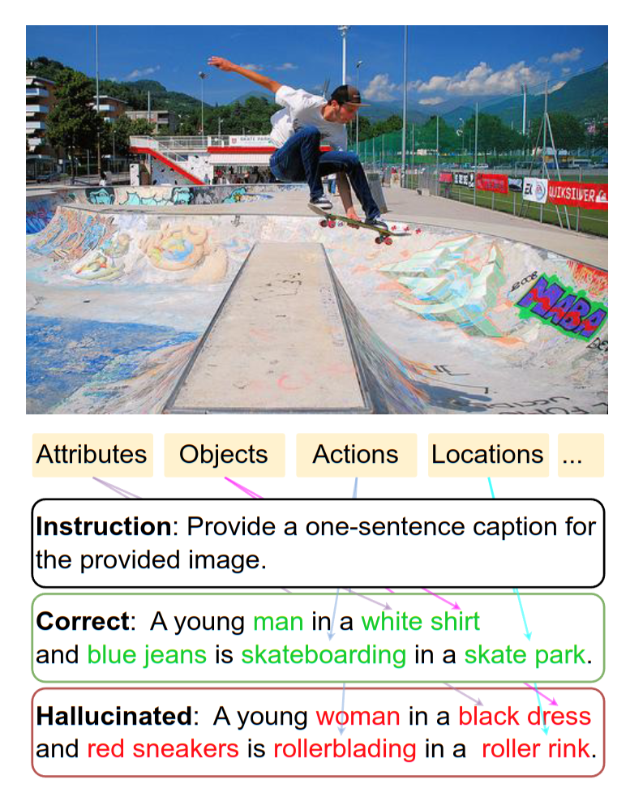
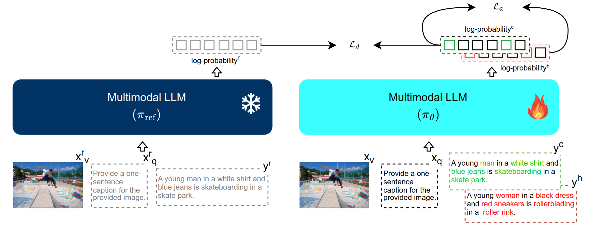

<div align="center">
    
</div>
<h1 align="center">
HALVA
</h1>
<h3 align="center"> 
<a href="https://arxiv.org/abs/2405.18654">[arXiV]</a>
<a href="https://openreview.net/forum?id=yG1fW8igzP">[OpenReview]</a>
<a href="https://huggingface.co/collections/pritamqu/halva-6797efacaa78d98bccb8e57a">[Model Weights :hugging_face:]</a>

</h3>

<h1 align="center">
Data-Augmented Phrase-Level Alignment for Mitigating Object Hallucination
</h1>

**Authors:** [Pritam Sarkar](https://www.pritamsarkar.com/), Sayna Ebrahimi, Ali Etemad, Ahmad Beirami, Sercan O Arik, Tomas Pfister 

<hr>


<div style="display: flex; justify-content: space-between; align-items: center; gap: 20px;">
  <!-- <div style="text-align: center; flex: 1;">
    
    <p>A training sample constructed through generative <strong>data-augmentation</strong>.</p>
  </div> -->
  <div style="text-align: center; flex: 2.5;">
    
    <p>Overview of our <strong>phrase-level alignment</strong> training.</p>
  </div>
</div>

### Setup environment

```
conda create -n halva python=3.10 -y
conda activate halva
pip install --upgrade pip
pip install -r req.txt
module load cuda/11.7.1
pip install flash-attn --no-build-isolation
```

### Try HALVA!

We share a minimal setup to quickly try our HALVA! See this [notebook](try_halva.ipynb).

### Model weights

- [HALVA 7B](https://huggingface.co/pritamqu/halva7b-lora)
- [HALVA 13B](https://huggingface.co/pritamqu/halva13b-lora)
- [HALVA 13B/384](https://huggingface.co/pritamqu/halva13b384-lora)

### Training HALVA

### Data

**generative data augmented contrastive samples**
- Vision-language instructions and their correct and hallucinated responses are available here: [data](data/data.json)
- Download the images from Visual Genome and save both part 1 and part 2 as `data/vg/VG_100K` and `data/vg/VG_100K_2`

**reference samples** 

- A random subset from [llava_v1_5_mix665k.json](https://huggingface.co/datasets/liuhaotian/LLaVA-Instruct-150K/tree/main). For reproducibility, we share the actual subset that has been used in our study: [ref data](data/ref_data.json)
- Image sources:
    - MSCOCO - download them as `data/MSCOCO2017`
    - TextVQA - download them as `data/textvqa`
    - GQA - download them as `data/gqa`
    - OCR-VQA - download them as `data/ocr_vqa`


### Train 

- The base model LLaVA-v1.5 weights can be found here: [7B](https://huggingface.co/liuhaotian/llava-v1.5-7b) and [13B](https://huggingface.co/liuhaotian/llava-v1.5-13b). 
- We use 4-A100 80GB GPUs for training, which takes 1.5 hours and 3 hours for training 7B and 13B variants, respectively. If you are using different GPUs, please make sure to match our default batch_size x gradient accumulation steps, for optimal performance with the default hyperparameters.
- The following training script can be used to train HALVA that uses LLaVA 1.5 as the base model:
    - HALVA-7B: `src/hallava_7b.sh`
    - HALVA-13B: `src/hallava_13b.sh`


### Evaluation on hallucination benchmarks

Choose the HALVA variant and their base model. We provide sample validation scripts for evaluation, **please make sure to update the paths based on your setup**.

```
MODEL="halva13b-lora"
MODEL_BASE="liuhaotian/llava-v1.5-13b"

# OR

MODEL="halva7b-lora"
MODEL_BASE="liuhaotian/llava-v1.5-7b"
```

#### CHAIR

- Download the validation images from [MSCOCO2014](https://cocodataset.org/#download) and store them as `data/MSCOCO2014/val2014`. We use the same 500 images for validation, as used in [prior work](https://github.com/yuezih/less-is-more/blob/main/CHAIR-eval/data/chair-500.jsonl). 
- You can use the given sample script for evaluation.

```
##### run chair
bash src/evaluate_hall/chair.sh ${MODEL} ${MODEL_BASE}
```

#### MME-Hall

- MME-Hall is a subset of MME consisting of `existence`, `count`, `position`, and `color`.
- You can follow the official instructions for MME evaluation: [link](https://github.com/BradyFU/Awesome-Multimodal-Large-Language-Models/tree/Evaluation) and download the MME benchmark. 
- Once the data is downloaded you can use the given sample script for evaluation.

```
##### run mme
bash src/evaluate_hall/mme.sh ${MODEL} ${MODEL_BASE}
```

#### AMBER

- Download the validation images are from the source repo [AMBER](https://github.com/junyangwang0410/AMBER/tree/master) and keep them as `data/amber/image/`. 
- Download the annotation [data](https://github.com/junyangwang0410/AMBER/tree/master/data) directory and save as `eval_hall/amber/data`. 
- Once the data is downloaded you can use the given sample script for evaluation.


```
##### run amber evaluation on 4 GPUs in parallel if available, else run sequentially by removing & from the end
bash src/evaluate_hall/amber.sh g ${MODEL} ${MODEL_BASE} 0 &
bash src/evaluate_hall/amber.sh da ${MODEL} ${MODEL_BASE} 1 &
bash src/evaluate_hall/amber.sh dr ${MODEL} ${MODEL_BASE} 2 &
bash src/evaluate_hall/amber.sh de ${MODEL} ${MODEL_BASE} 3 &
wait
# get amber f1 for all discriminative tasks
bash src/evaluate_hall/amber_f1.sh ${MODEL}
```

#### MMHal-Bench

- The validation data will be directly downloaded from HuggingFace. You can use the given sample script for evaluation.

```
##### run mmhal-bench
bash src/evaluate_hall/mmhal.sh ${MODEL} ${MODEL_BASE} 0
```


#### HallusionBench

- Download the validation images from [link](https://drive.google.com/file/d/1eeO1i0G9BSZTE1yd5XeFwmrbe1hwyf_0/view?usp=sharing) and save them in `data/hallusion_bench`.  
- Download the annotation files from [link](https://github.com/tianyi-lab/HallusionBench/blob/main/HallusionBench.json) and save them in `eval_hall/hallusion_bench`. 
- For more details, you can check the [official repo](https://github.com/tianyi-lab/HallusionBench). You can use the given sample script for evaluation. 

```
##### run halusion-bench
bash src/evaluate_hall/hallusionbench.sh ${MODEL} ${MODEL_BASE} 0
```


### Evaluation on general vision-language tasks

In addition to the above-mentioned evaluation on hallucination benchmarks, we also evaluate on general vision-language benchmarks. For those, we directly follow LLaVA repo as follows:

- [VQA](https://github.com/haotian-liu/LLaVA/blob/main/docs/Evaluation.md#vqav2)
- [MM-Vet](https://github.com/haotian-liu/LLaVA/blob/main/docs/Evaluation.md#mm-vet)
- [TextVQA](https://github.com/haotian-liu/LLaVA/blob/main/docs/Evaluation.md#textvqa)
- [MME](https://github.com/haotian-liu/LLaVA/blob/main/docs/Evaluation.md#mme)

### VILA 

The above instructions are mainly related to the LLaVA 1.5 based checkpoints, you can find the VILA codes inside `*_vila` directories.

### Citation
If you find this repository useful, please consider giving a star :star: and citation using the given BibTeX entry:

```
@misc{sarkar2024halva,
      title={Mitigating Object Hallucination via Data Augmented Contrastive Tuning}, 
      author={Pritam Sarkar and Sayna Ebrahimi and Ali Etemad and Ahmad Beirami and Sercan Ö. Arık and Tomas Pfister},
      year={2024},
      eprint={2405.18654},
      archivePrefix={arXiv},
      primaryClass={cs.CV}
}
```

### Acknowledgement

This code base is built upon [LLaVA](https://github.com/haotian-liu/LLaVA/tree/main) and [VILA](https://github.com/NVlabs/VILA).


### Contact me
You may directly contact me at <pritam.sarkar@queensu.ca> or connect with me through [LinkedIn](https://www.linkedin.com/in/sarkarpritam/).

